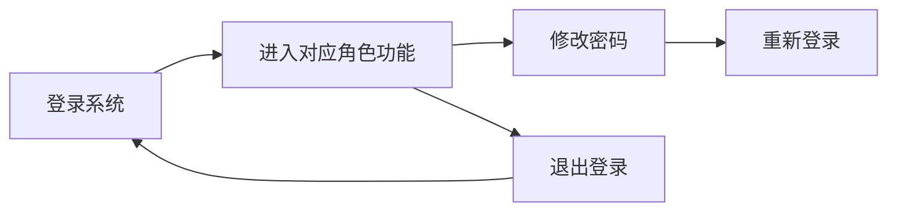
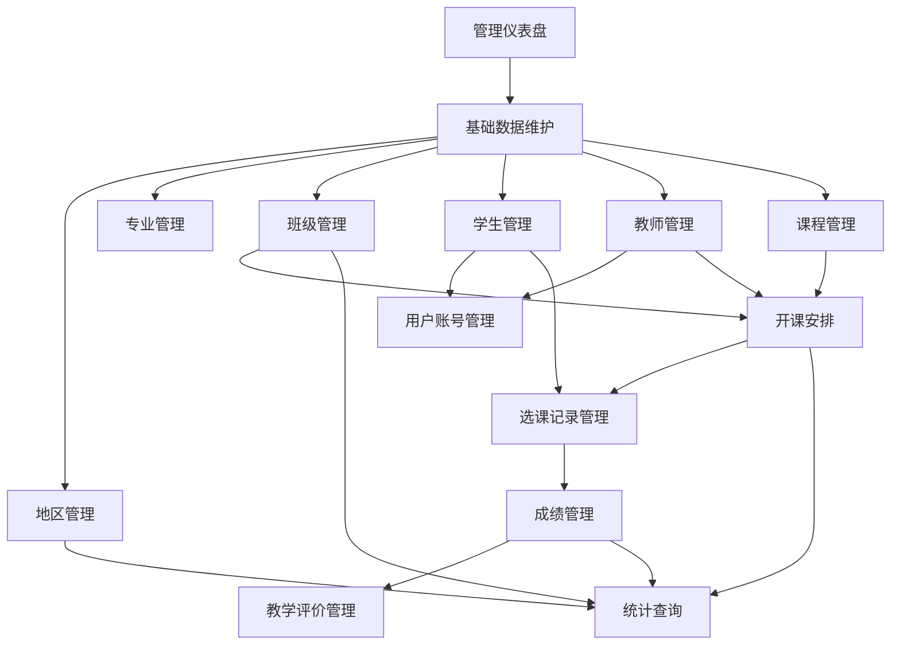
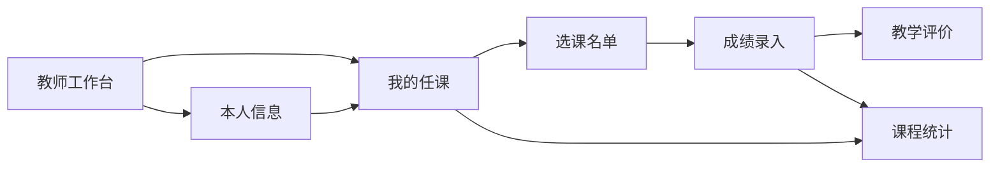
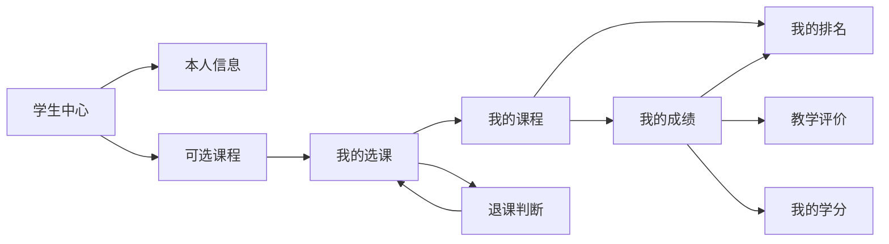

# 角色功能说明

本文档只说明系统中每个角色拥有的功能，以及每个角色内部功能之间如何配合。

## 1. 公共功能

所有角色都拥有以下公共功能：

| 功能 | 说明 |
|---|---|
| 登录系统 | 使用账号和密码登录系统，系统根据账号角色进入对应工作台。 |
| 修改密码 | 登录后可修改当前账号密码，修改成功后需要重新登录。 |
| 退出登录 | 退出当前账号，返回登录状态。 |

公共功能关系：

1. 用户必须先登录系统，才能使用对应角色的业务功能。
2. 修改密码依赖当前账号已登录，并且需要校验原密码。
3. 退出登录后，不能继续使用任何角色功能，需要重新登录。

## 2. 管理员功能

管理员拥有系统全局管理能力，主要负责基础数据维护、业务数据维护、账号维护和统计查询。

| 功能 | 说明 |
|---|---|
| 管理仪表盘 | 查看管理员可操作模块入口，快速进入基础数据、开课选课、成绩学分和统计功能。 |
| 地区管理 | 维护学生生源地等地区基础数据。 |
| 专业管理 | 维护学校专业基础数据。 |
| 班级管理 | 维护班级信息、所属专业和入学年级。 |
| 学生管理 | 维护学生学号、姓名、性别、年龄、班级、生源地和已修学分等信息。 |
| 教师管理 | 维护教师编号、姓名、性别、年龄、职称和联系电话等信息。 |
| 课程管理 | 维护课程编号、课程名称、学时、考核方式和学分。 |
| 开课安排 | 将课程、班级、教师、学年学期、课程类型、容量、选课开放状态和周内上课时间组合成具体开课记录；课程、班级、教师通过下拉选择，上课时间通过选择当日第几节课自动生成，并按课程学时显示一组或两组课程时间。 |
| 选课记录管理 | 查询学生选课记录；通过学生和开课安排下拉新增、恢复或退选选课记录。 |
| 成绩管理 | 查询、录入、修改和删除学生成绩；录入成绩时通过有效选课记录下拉定位学生课程。 |
| 教学评价管理 | 按教师查看该教师教学班，再查看不同学生对对应教学班的评价等级、理由和提交时间。 |
| 统计查询 | 查看地区学生数、课程平均分、学生学分汇总、教师任课、班级开课、学生学年成绩和课程排名；查询对象通过下拉选择。 |
| 用户账号管理 | 维护管理员、教师、学生账号，设置角色，通过学生或教师下拉绑定档案，并控制账号启用状态。 |

管理员左侧菜单按大类折叠：

| 菜单大类 | 子功能 |
|---|---|
| 工作台 | 管理仪表盘 |
| 基础数据 | 专业管理、班级管理、学生管理、教师管理、课程管理、专业课程计划 |
| 教务业务 | 开课安排、选课记录、成绩管理、教学评价 |
| 查询与账号 | 统计查询、用户账号 |

管理员内部功能配合关系：

1. 管理仪表盘负责集中入口，管理员从这里进入基础数据、开课选课、成绩学分和统计查询等模块。
2. 地区管理、专业管理、班级管理、学生管理、教师管理、课程管理共同构成基础数据维护链路。其中地区用于学生生源地，专业用于班级归属，班级用于学生归属，教师和课程用于后续开课安排。
3. 开课安排把课程管理、班级管理、教师管理中的数据组合起来，形成某学年学期的具体教学任务；它是选课记录管理和成绩管理的业务起点。管理员创建开课安排时通过下拉选择课程、班级和教师，避免编号填错。
4. 选课记录管理承接开课安排和学生管理的数据，用于维护学生参加某个开课安排的状态；选课记录正常后，后续才能围绕该记录维护成绩。新增或恢复选课时通过学生和开课安排下拉定位数据。
5. 成绩管理依赖选课记录管理，成绩必须关联到具体选课记录；成绩录入后，会影响学生学分、课程平均分和课程排名等统计结果。成绩录入时只选择有效选课记录。
6. 教学评价管理依赖已完成课程，学生提交后管理员可以按教师和教学班查看不同学生评价；管理员只查看，不修改评价。
7. 统计查询汇总前面各模块产生的数据：地区统计依赖地区和学生数据，任课统计依赖教师和开课安排，学分统计依赖成绩和课程学分，排名统计依赖成绩。学生学年成绩和课程排名查询通过下拉选择对象。
8. 用户账号管理与学生管理、教师管理配合使用：学生账号需要绑定学生档案，教师账号需要绑定教师档案；账号启用后，对应人员才能登录并使用自己的功能。
9. 管理员常见操作顺序是：维护基础数据 -> 创建用户账号 -> 发布开课安排 -> 管理选课记录 -> 管理成绩 -> 查看教学评价或统计查询。

## 3. 教师功能

教师拥有本人任课范围内的教学管理能力，主要负责查看任课、查看选课学生、录入成绩和查看课程统计。

| 功能 | 说明 |
|---|---|
| 教师工作台 | 查看教师常用功能入口，进入任课、选课名单、成绩录入和课程统计功能。 |
| 我的任课 | 查看本人负责的课程、班级、学年学期和成绩概况，并可直接进入名单、成绩录入和排名。 |
| 选课名单 | 按本人任课课程查看学生选课名单，包括已选、已完成或退选状态；从我的任课进入时自动带入课程。 |
| 成绩录入 | 为本人任课课程中的学生录入或修改成绩，并显示已录和未录人数。 |
| 教学评价 | 按本人教学班查看学生提交的评价等级、理由和提交时间。 |
| 课程统计 | 查看本人任课课程的平均分和指定课程的成绩排名；从我的任课进入时自动带入课程。 |
| 本人信息 | 查看当前账号绑定的教师档案和联系方式。 |

教师左侧菜单按大类折叠：

| 菜单大类 | 子功能 |
|---|---|
| 工作台 | 教师工作台 |
| 教学管理 | 我的任课、选课名单、成绩录入、教学评价 |
| 查询与个人 | 课程统计、本人信息 |

教师内部功能配合关系：

1. 教师工作台负责集中入口，教师从这里进入我的任课、选课名单、成绩录入和课程统计。
2. 本人信息用于确认当前账号绑定的教师档案，是判断后续任课数据是否属于当前教师的基础信息。
3. 我的任课是教师业务的核心起点，教师先查看自己负责哪些课程、班级、学年学期，再通过行内操作进入对应课程的名单、成绩录入或排名。
4. 选课名单围绕我的任课展开，教师从我的任课进入时系统自动带入课程；也可以手动选择本人任课课程后查看学生名单。
5. 成绩录入与选课名单配合使用：教师先确认课程和学生名单，再为名单中的有效选课学生录入或修改成绩；页面会提示已录和未录人数。
6. 教学评价与成绩录入后的完成课程配合使用：学生完成课程并提交评价后，教师可以按本人教学班查看评价内容。
7. 课程统计与成绩录入配合使用：成绩录入或修改后，教师通过课程统计查看该课程平均分和成绩排名，用于掌握教学结果。
8. 教师常见操作顺序是：查看本人信息 -> 查看我的任课 -> 点击名单/录成绩/排名 -> 录入或修改成绩 -> 查看教学评价或课程统计。

## 4. 学生功能

学生拥有本人学习过程相关能力，主要负责选课、退课、查看课程、查看成绩、查看学分和查看排名。

| 功能 | 说明 |
|---|---|
| 学生中心 | 查看学生常用功能入口，进入选课、课程、课表、成绩、学分和排名功能。 |
| 可选课程 | 按课程、学年、学期或课程类型筛选当前开放选课且本人尚未有效选中的课程，并提交选课；若上课时间与本学期已选课程冲突，则不能选课。 |
| 我的选课 | 查看本人本学期已选、已退和已完成的课程记录；对符合条件的课程退课，并可继续进入课程、成绩、学分和排名。 |
| 我的课程 | 查看当前账号本学期关联的课程清单。 |
| 我的课表 | 查看本学期周一到周五课表，按固定上课时间段形成网格，并按前半学期（第1-8周）和后半学期分别展示。 |
| 我的成绩 | 查看本人已录入成绩、课程、教师和学分信息。 |
| 教学评价 | 对本人已完成课程提交最终评价，等级分为五级，理由可填可不填；提交后不可修改。 |
| 我的学分 | 查看本人已完成课程、通过课程和已修学分汇总。 |
| 我的排名 | 选择本人已选课程后查看该课程成绩排名；暂无成绩时显示提示。 |
| 本人信息 | 查看当前账号绑定的学生档案、班级、专业、生源地和学分信息。 |

学生左侧菜单按大类折叠：

| 菜单大类 | 子功能 |
|---|---|
| 工作台 | 学生中心 |
| 选课学习 | 可选课程、我的选课、我的课程、我的课表、教学评价 |
| 成绩学业 | 我的成绩、我的学分、我的排名 |
| 个人班级 | 我的班级、本人信息 |

学生内部功能配合关系：

1. 学生中心负责集中入口，学生从这里进入选课、课程、课表、成绩、学分、排名和本人信息功能。
2. 本人信息用于查看当前账号绑定的学生档案、班级、专业、生源地和学分，是学生确认个人基础信息的入口。
3. 可选课程是学生学习流程的起点，学生先按课程、学年、学期或课程类型筛选当前可选课程，再选择需要修读的课程；系统会校验该课程上课时间是否与本学期已选课程冲突，选课成功后进入我的选课。
4. 我的选课承接可选课程的操作结果，学生选课后可在这里查看本学期课程状态；如果课程未录入成绩且符合退课条件，可在这里退课，也可继续进入我的课程、我的课表、我的成绩、我的学分和我的排名。
5. 我的课程基于我的选课生成，用于把本学期选课记录整理成课程清单；我的课表基于有效选课记录，按固定上课时间段、周一到周五、前半学期和后半学期展示课程安排。
6. 我的成绩依赖我的课程和成绩录入结果，学生通过它查看每门课程的成绩、教师和学分。
7. 教学评价依赖已完成课程，学生对完成课程选择五级评价并可填写理由；评价提交后即为最终评价，不允许修改。
8. 我的学分与我的成绩配合使用，成绩达到要求后会进入学分汇总，用于查看已完成课程、通过课程和已修学分。
9. 我的排名与我的成绩配合使用，学生选择本人已选并已有成绩数据的课程后，查看该课程排名；如果课程暂无成绩排名，系统给出提示。
10. 学生常见操作顺序是：查看本人信息 -> 筛选可选课程并选课 -> 查看我的选课 -> 查看我的课程/课表/成绩 -> 提交教学评价 -> 查看学分/排名。
